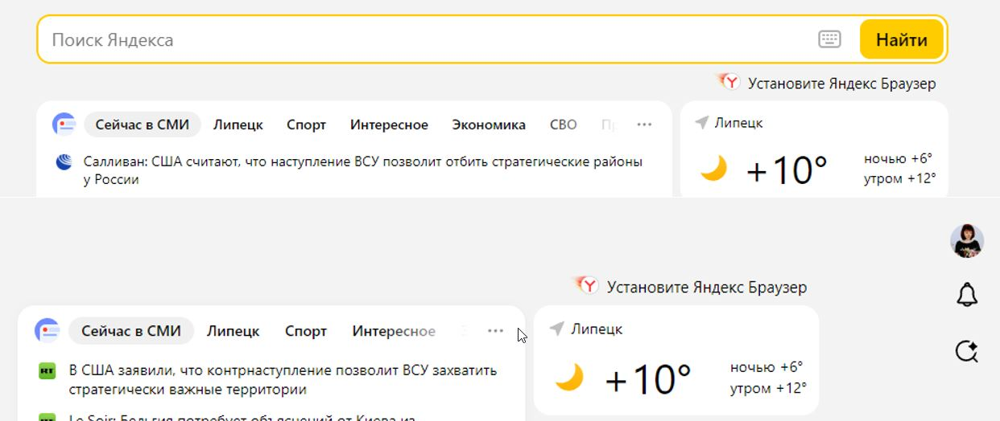
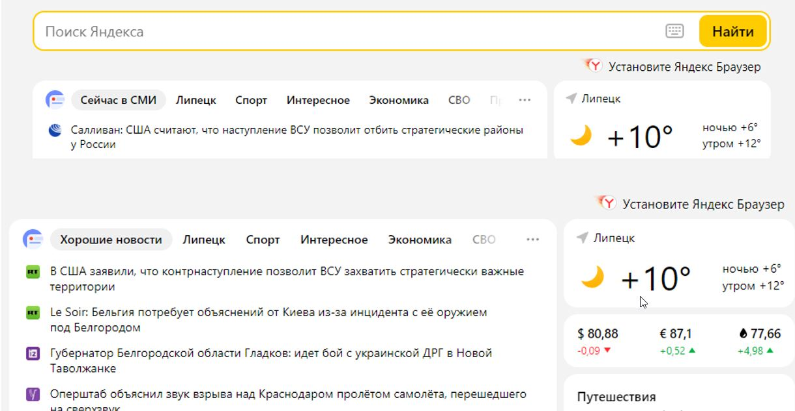
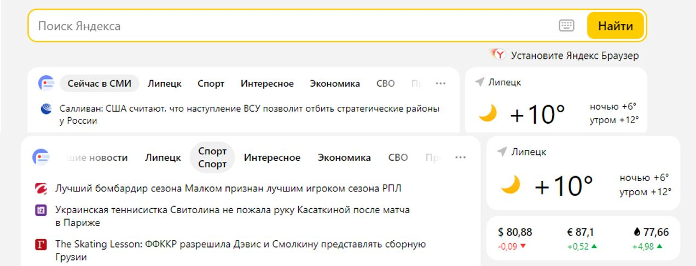
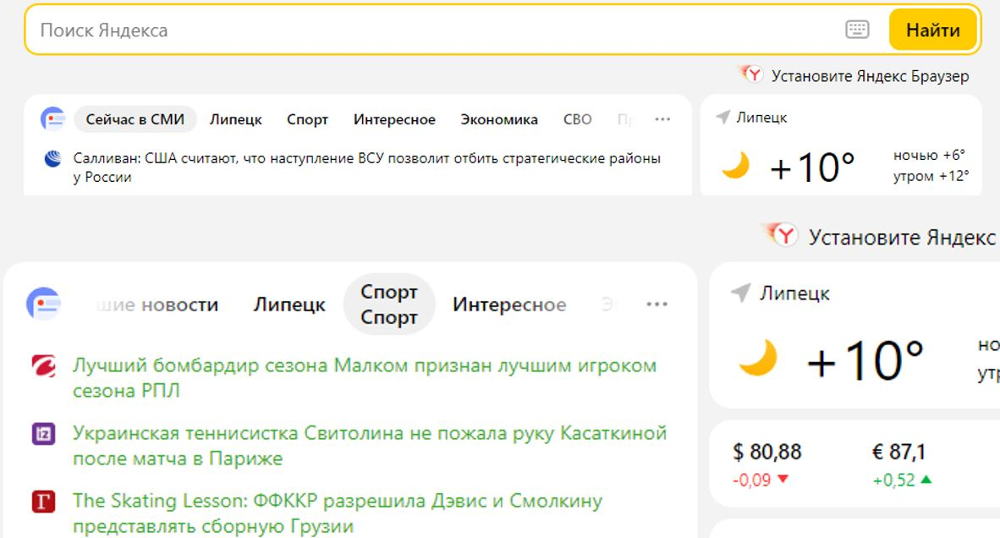
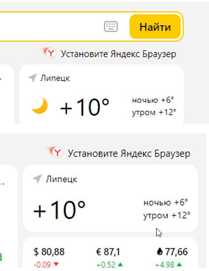
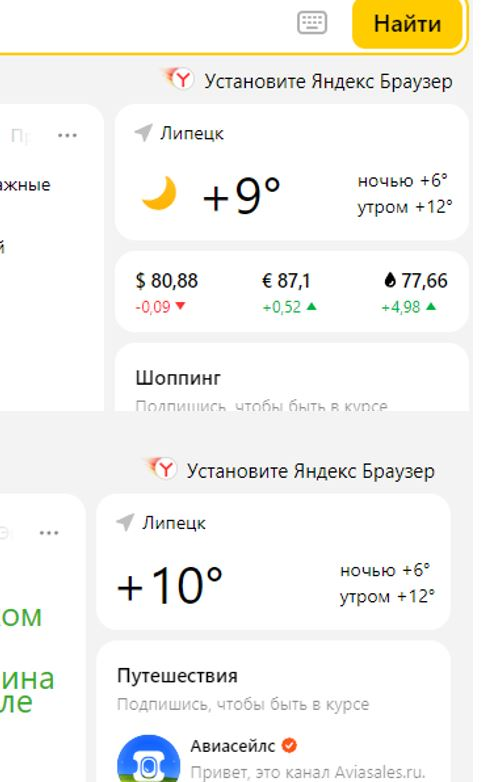
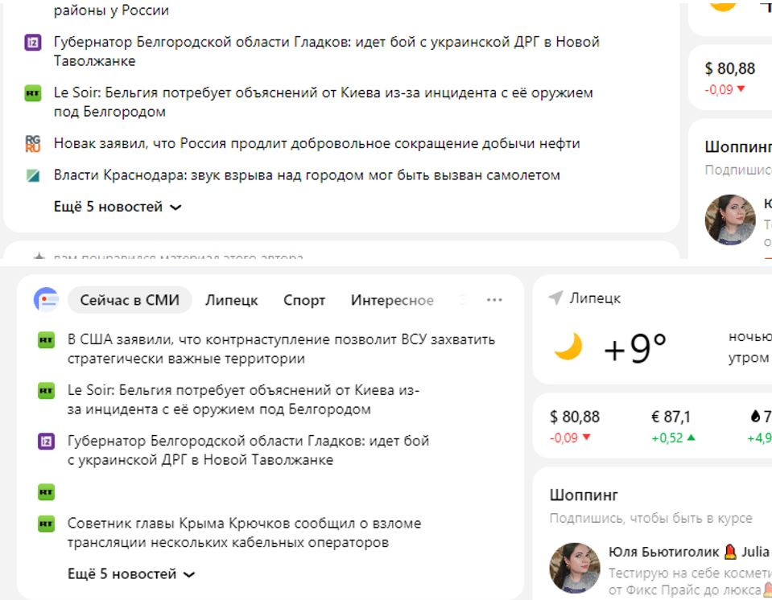
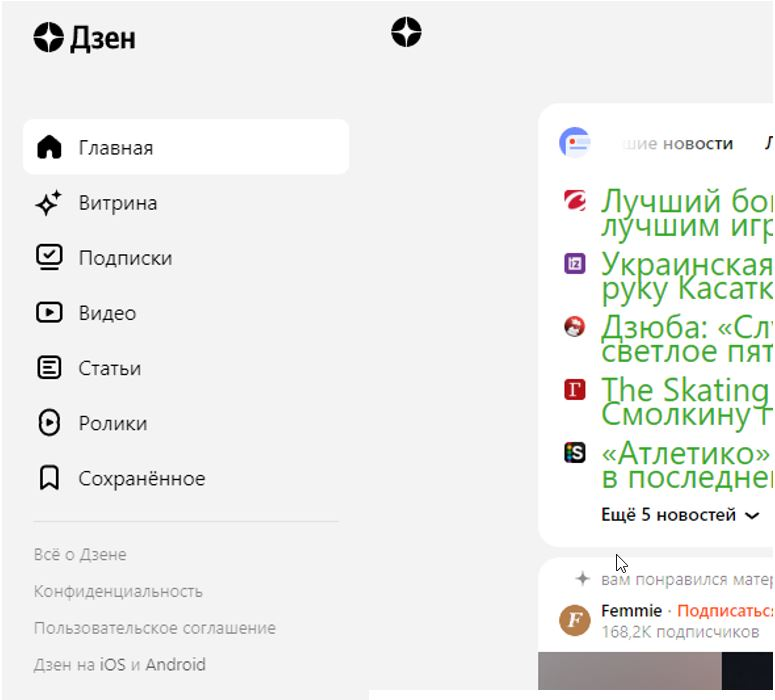

# Веб-технологии: вчера, сегодня, завтра
## 1. Определите, на каком протоколе работает сайт.
Сайт yandex.ru работает на протоколе https, название которого присутствует в полном наименовании сайта и отображается "замком".

 

## 2.Проанализируйте структуру страницы сайта.

Страница сайта состоит из:
1. шапки, в которой размещена поисковая строка.
2. зоны контента, в которой размещены новости, разбитые по тематикам, ссылки на статьи Дзен и рекламные блоки. Лента зоны контента бесконечная.
3. зоны виджетов. С левой стороны находится меню переключения Дзен контента. С правой стороны: прогноз погоды, котировки и реклама каналов Дзена.

## 3.Внесите не менее 10 изменений на страницу с помощью инструмента разработчика и представьте скриншоты было/стало.

1. Удалена поисковая строка.

2. Исправлено название новости.

3. Задвоено название новости.

4. Изменен цвет шрифта.

5. Изменен размер шрифта.

6. Удалена иконка месяца.

7. Удален блок котировок.

8. Удалена одна новость.

9. Изменен цвет поисковой строки.

10. Удалено меню Дзена.

## 4.Создайте прототип низкой детализации.
[Прототип сайта "Рога и копыта"](https://wireframe.cc/jN6jqz)